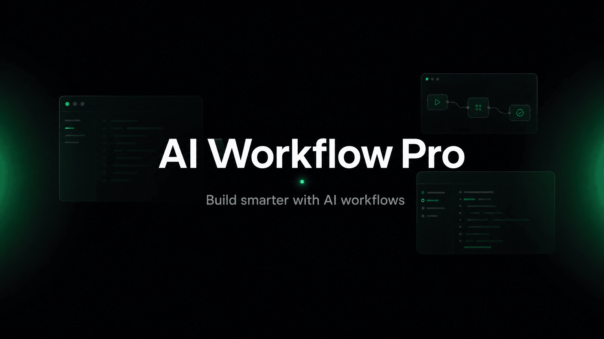

  

<em>Indie AI building, in public.</em>

  
  
  

---

## 👋 About

> I'm Leo. AI Workflow Pro is where I build AI tools in public — the products, the process, the lessons.

I've chased the "workflow" idea across four generations of tools, and now I run a one-person product studio: small AI tools, public numbers, failures included. Paying users decide what survives.

No sponsors, no consulting. I sell things that run without me. English is my second language, so I keep the prose plain.

---

## 🔨 What I Build

A portfolio of small AI products, built and operated in the open.

Most build-in-public accounts share the story of one product growing up. I share something messier and more honest: the daily running of a whole portfolio. What gets started, what gets archived, how the scoreboard moves, and which paying signals decide where my time goes next.

Every product here solves a problem I hit myself first. No course pitch, no overnight success. Just a live record of an indie AI business taking shape, one tool at a time.

---

## ⚙️ How I Work

- **Small bets.** Cheap to build, honest to test. The market picks the winners. I just keep score in public.
- **Only what I've run.** If I haven't broken it, I won't write about it.
- **Watching, not selling.** Multi-agent and AI companies are real, but I'm not packaging the next wave as advice. I'd rather be the second-wave post-mortem than the first-wave hype.
- **No sponsors, no consulting.** I don't sell my time. If it's worth teaching, it ships as a tool or a template.

---

## 🚀 Start Here

- 🌐 [aiworkflowpro.com](https://aiworkflowpro.com)
- 📚 Tutorials → [hands-on walkthroughs](https://aiworkflowpro.com/tag/tutorials/)
- 🛠️ Builds → [build-in-public notes](https://aiworkflowpro.com/tag/builds/)
- 𝕏 Daily notes → [@aiworkflowprolk](https://x.com/aiworkflowprolk)
- ▶️ Videos → [@aiworkflowprolk on YouTube](https://www.youtube.com/channel/UCTVDdiLRI_7TkyFKmZ2-f7Q)

---

## 📦 Open-Source Policy

Public repos here are clean snapshots — tools, examples, and docs meant to be searched, reused, and inspected safely. Product source code, work-in-progress experiments, and internal automation stay private by default.

---

Tools change. The question underneath them doesn't.

<b>— Leo</b>

